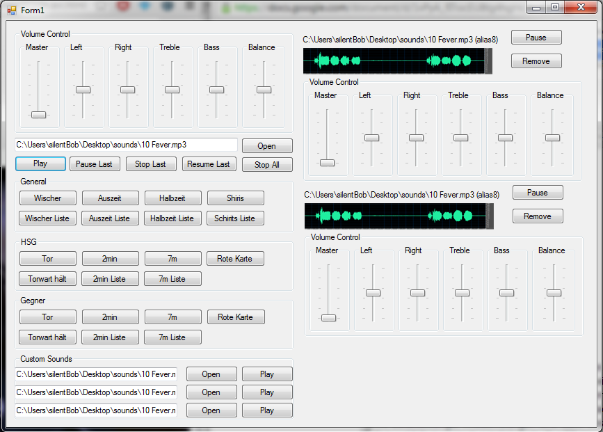

#DEPRICATED#
(and way to crappy CLI c++ software done for university)

## SoftwareProjektTUBAF2013 ##

currently in work, readme will be updated, when there is something to talk about :)

Visual Studio 2008 with gitHub Howto
http://www.youtube.com/watch?v=OcjMg8sQg5I 

GitHub explained:
- http://rogerdudler.github.io/git-guide/index.de.html [german]
- http://git-scm.com/book
- http://pcottle.github.io/learnGitBranching/

MCI Error Codes:

- http://www.vbforums.com/showthread.php?276466-mci-error-codes 

###Programming Conventions

* variables
	*start with small letter
	*generic lists start with list_*

* methods 
	* i.g. getSound(), drawWaveform(), playSound()

* comments
	* srsly use them!
	* code is written for the next person reading it

* github
	* only push working code
	* merging is caring, if you are not quite sure
		* a) contact counterpart
		* b) comment code out but do not delete it

* formcontrols
	* naming naming naming

* exceptions
	* catch them
	* be friendly
	
* general
	* use VisualStudio2008
	* easy is beautiful, to fancy is nasty :)
	* eleminate all warnings and errors before commiting into master branch
	* CamelCase is your friend
	* use VS2008 Shortcuts '[Ctrl]' + '[A]'  in combination with '[Ctrl]' + '[K]' + '[F]' to format code
	
		
* suggestions are welcome

